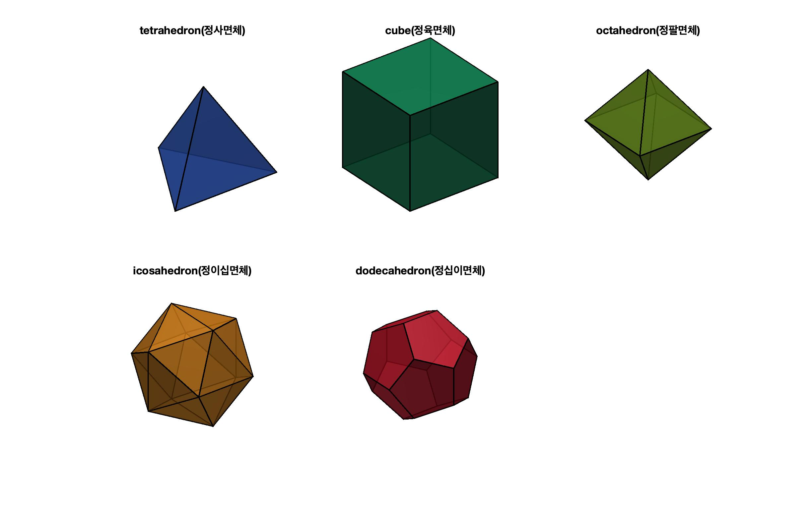
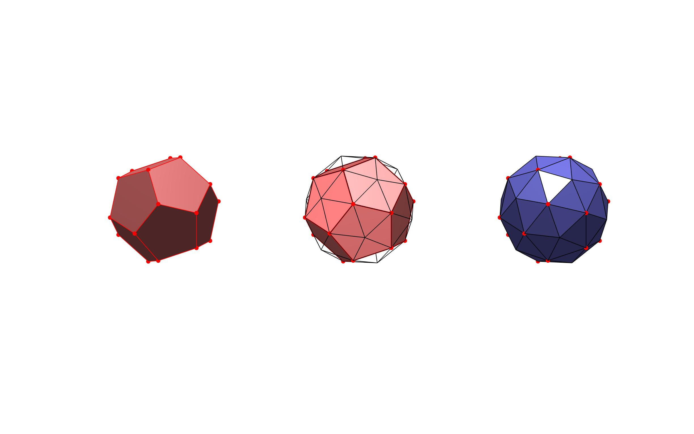
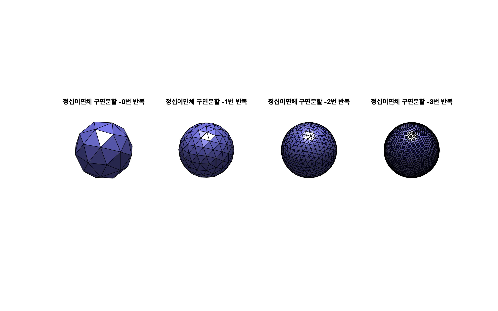
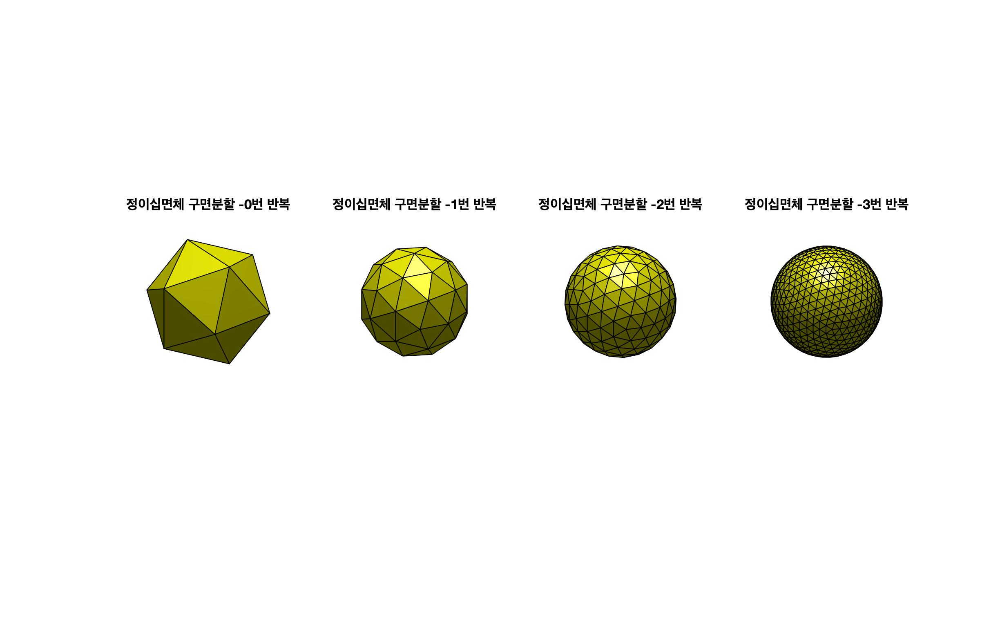
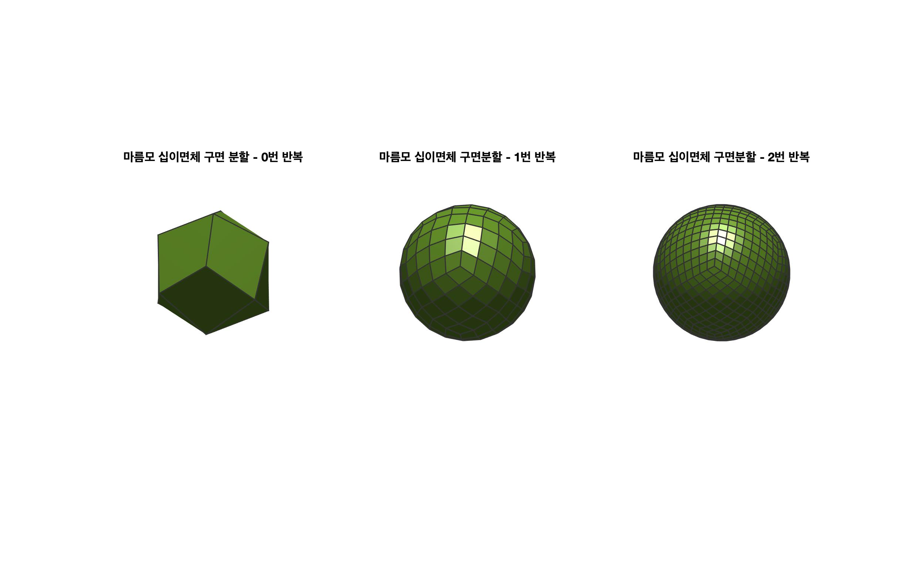

# geoSphere

## Getting Started
1. Install MATLAB
2. Download & Install [GIBBON](https://github.com/gibbonCode/GIBBON) library
    - [How to install](https://github.com/gibbonCode/GIBBON#installation-)
3. Run **makeGeoSphere.m**

## Result
### 1. 정다면체

### 2. 정십이면체가 구에 가까워지기까지.

### 3. 정십이면체 구면분할

### 4. 정이십면체 구면분할

### 5. 마름모 십이면체 구면분할

